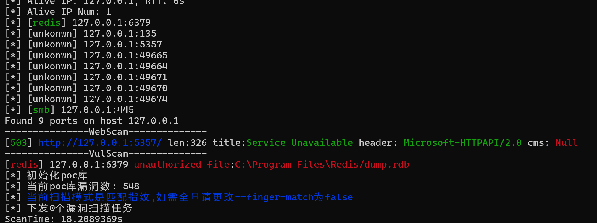

  

> 本工具仅供安全测试人员运用于授权测试, 禁止用于未授权测试, 违者责任自负

## What is Milkyway

一款内网全方位扫描工具，具备高效的机器探活，端口探活，协议识别，指纹识别，漏洞扫描等功能,
* 纯go实现的协议识别
* 丰富的扫描模式

> 如果你觉得这款工具不错的话，求star~

## Milkyway Features

1. 信息收集
    * IP 存活探测
    * 端口存活探测
    * web 探测
    * 协议识别 (mysql, redis, smb, ldap, ssh, vnc, ftp, smtp, rdp)
2. 爆破功能
   * `ssh`
   * `mysql`
   * `redis`
   * `vnc`
   * to be continued
3. 漏洞检测
   * `redis`未授权
   * 永恒之蓝/永恒之黑
   * 支持nuclei漏洞引擎，内置4000+常用poc
   * 支持自定义漏洞预加载目录或文件
   * 支持通过`tags`, `id`来选择poc
5. 附带功能
   * http/socks5代理
   * 目标从文件读取
   * 支持`fofa`语句,目标从`fofa`拉取
   * 日志实时打印
   * 支持`url`的输入

### Advanced Configuration

* `--full-scan   ` 对开放的端口进行全协议识别,默认只进行特定端口的协议识别
* `--verbose     ` 打印协议的详细信息,默认不打印
* `--finger-match` 漏洞扫描前的指纹规则匹配,默认开启
* `--poc-file    ` 自定义`nuclei poc`文件/目录
* `--fofa-query  ` 使用`fofa`语句提取目标 `当使用fofa语句导入目标时，系统环境变量FOFA_KEY必须设置成的你的fofa-key`

### Basic Usage

`milkyway.exe -t 192.168.1.1/24 (端口默认是default, 排名前809个端口)`

`milkyway.exe -t 192.168.1.1/24 -s socks5://127.0.0.1:1080 (使用socks5代理)`

`milkyway.exe -t 192.168.1.1/24 -c 500 (设置线程池工人数量)`

### Advanced Usage

`milkyway.exe -t 192.168.1.1/24 -p company` (使用公司常用87个端口)

`milkyway.exe -t 192.168.1.1/24 -p small --full-scan true` (对前12个端口进行全协议识别)

`milkyway.exe -t 192.168.1.1/24 --finger-match false` (漏洞扫描不进行指纹匹配)

`milkyway.exe --fofa-query domain=baidu.com` (fofa语句提取目标)

`milkyway.exe -t 192.168.1.1/24 --poc-file ./your_file` (自定义漏洞目录)

`milkyway.exe -t 192.168.1.1/24 --poc-tags cve,cnvd` (指定多个poc标签)
> sql: 常用数据库端口, small: 常用前12个端口, all: 全端口
### Running Picture

  

# 参考项目
https://github.com/shadow1ng/fscan

https://github.com/EdgeSecurityTeam/EHole

https://github.com/chainreactors/neutron
