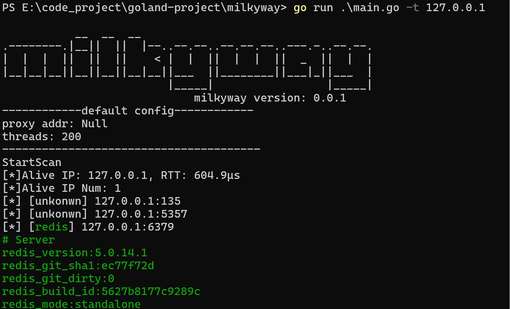
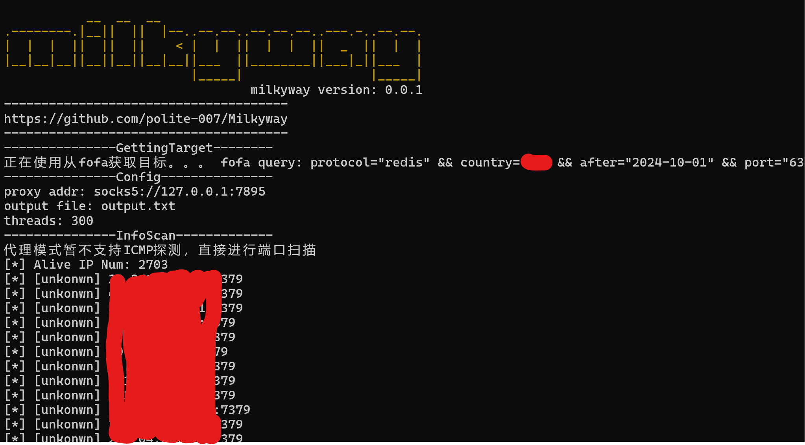
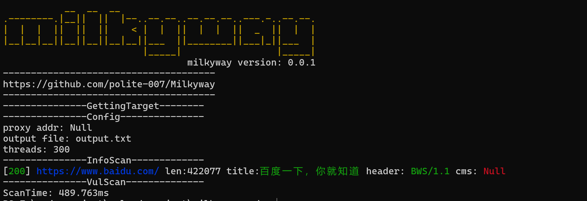
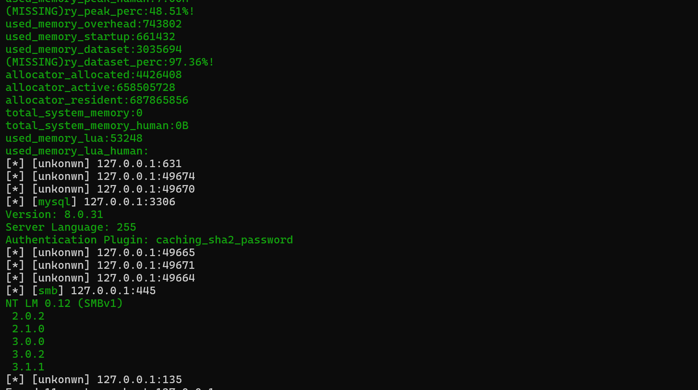

  

<h4 align="center">An innovative vulnerability scanner and Pentest Tool </h4>

## What is Milkyway

MilkyWay 一款内网综合扫描工具，目前结合机器探活，端口探活，协议识别，漏洞扫描等功能。指纹识别手动研发，不依赖nmap，同时提供了多种代理支持和实时日志打印功能

## Milkyway Features

1. 信息收集
    * IP 存活探测
    * 端口存活探测
    * 协议识别
        * mysql
        * redis
        * smb
        * ldap
        * ssh
        * vnc
        * ftp
        * smtp
        * rdp
        * to be continued
    * web 探测

2. 爆破功能
   * ssh
   * mysql
   * redis

3. 漏洞检测
   * redis 未授权
   * 支持nuclei漏洞引擎，内置500多个常用poc
   * 支持自定义漏洞预加载目录或文件

4. 漏洞利用
   * to be c**ontinued**

5. 附带功能
   * http/socks5代理
   * 目标从文件读取
   * 支持fofa语句,目标从fofa拉取
   * 日志实时打印
   * 支持url的输入

## SomeThing

* --full-scan 是否对开放的端口进行全协议识别，默认的协议识别策略是对常用端口进行只进行对应的协议识别，比如22-ssh，3306-mysql，如果开启全协议识别，扫描速度势必会慢很多
* --verbose 是否打印协议的详细信息，默认只打印协议名称

## Usage Tutorial

`milkyway.exe -t 192.168.1.1/24 (端口默认是default, 排名前809个端口)`

`milkyway.exe -t 192.168.1.1/24 -p company (使用公司常用87个端口)`

`milkyway.exe -t 192.168.1.1/24 -p sql (使用数据库常用端口)`

`milkyway.exe -t 192.168.1.1/24 -p samll (使用渗透最常见端口, 排名前12的端口)`

`milkyway.exe -t 192.168.1.1/24 -s socks5://127.0.0.1:1080 (使用socks5代理)`

`milkyway.exe -t 192.168.1.1/24 -c 500 (设置线程池工人数量)`

`milkyway.exe --fofaquery fofaquery.txt -k your-key -p 6379 (从fofa语句提取目标，进行6379端口的扫描)`

`milkyway.exe -u https://www.baidu.com (web 探测)`

`milkyway.exe --poc-file ./your_file (使用自定义的poc文件/目录进行poc预加载)`

### Running Picture

# 参考项目
https://github.com/shadow1ng/fscan

https://github.com/EdgeSecurityTeam/EHole

https://github.com/chainreactors/neutron
